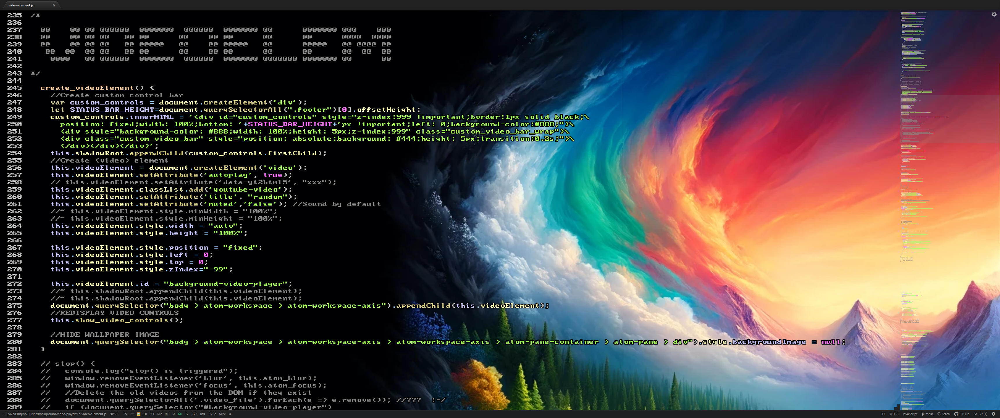

# Background video player / manager for Pulsar

*** ALPHA VERSION ***

[Pulsar GitHub Repository](https://github.com/pulsar-edit/pulsar)

## VIDEO DEMO :

### Play videos/images in background

Also system-wide, I personally use 4 different electron apps that will use the same images/videos.

⚠️ WARNING: I've just started porting this to Pulsar (from Atom), not everything is working yet. No need to tell me some things aren't working. but basic stuff should. 😛

## Installation

Move to your pulsar packages folder, clone this repo with the name "background-video-player" and install npm dependencies :

    cd ~/.pulsar/packages/
    git clone https://github.com/justUmen/plugin-pulsar-background-video background-video-player
    cd background-video-player
    npm install

Launch Pulsar.  
Change for custom variables in Settings and restart Pulsar.

## Usage

I don't recommend using it for everything, it might clutter your vision and cause your eyes to bleed. 🫣

I personally just use Pulsar as a secondary editor when i have a lot of time to spend on a single file. (In combination with another project HtmlWallpaper - not released yet -)

You can also use images than have plain color on the first half the screen (white or black), and have the right half of the image to be an image or whatever.  
This way, the text is still very readable and if sometimes the code (or text) goes above the image, the text-shadow will still make it readable. But it's all up to you, same goes for the font.  

Example for my ultrawide : 

